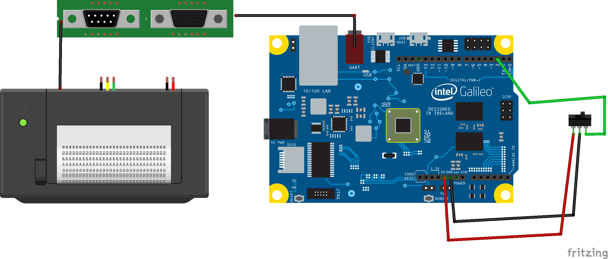

#TODO Sample on Galileo

## Contents
- [Components](#components)
- [Connection](#Connection)
- [How to Run it](#how-to-run-it)
- [How The Code Is Broken Up](#how-the-code-is-broken-up)
- [Tips](#tips)

---

### Components
- Intel Galileo Board
- Windows Image on microSD card
- Push button (3 -pin switch)
- Serial Printer
- Serial cable and connector

---

### Connection

1. Push button or 3 -pin switch is connected to 5V, GND and D2 on the Galileo.
1. Galileo is plugged in and connected to network.
1. A serial POS printer is connected to 

---

### How to Run it

 Using Telnet and your development computer 

- You can either remote deploy or move the todo_sample.exe directly onto your Galileo (either way make sure it's on your Galileo)
- When in a telnet session connected to your Galileo, launch the todo_sample.exe (built from the project)
- Now you should be able to print the Todo list which got posted to OneNote with a Push button press.

---

### How The Code is Broken Up
- Main.cpp
- MinHttpGP.cpp and .h
- MinXHttpRqst.cpp and .h
- MinSer.cpp and .h
- OneNoteHelper.cpp and .h
- Authentication

**_Main_**

- 	Example setup() and loop() functions for working with OneNote pages (http GET/POST interface) and printing contents to a serial POS printer.

**_MinHttpGP_**

- 	A minimal object library for sending high level https:// GET and POST requests to a web server.  
-	In conjunction with MinXHttpRqst, shows how to use the built in WinINET com library.

**_MinXHttpRqst_**

- 	Class implementation for IXMLHTTPRequest3Callback asynchronous GET/POST requests.
-	Class implementation for ISequentialStream used in asynchronous POST requests.

**_MinSer_**

- 	A minimal object library for asynchronous serial interface.  Overlapped IO used to avoid blocking on communications to POS device. 

**_OneNoteHelper_**

- 	A basic object library for Reading and Writing pages to OneNote cloud services.  OneNote services API online docs are [here](http://dev.onenote.com/docs) 
-	Getting started with OneNoteAPI, including how to sign in a user, and obtaining an OAuth token to include in page requests to the server, can be found in the MSDN reference [here](http://msdn.microsoft.com/en-us/library/office/dn575425(v=office.15).aspx) 

**_Authentication_**

-	Specifics on developing for Live services (OneDrive, Outlook.com, etc.) can be found on [MSDN](http://msdn.microsoft.com/en-us/library/hh243641.aspx) 
-	A sample request URI for getting a temporary authentication code from live.com is below. This URI can be used with any browser, and includes client_id, scope, response_type, and redirect value for our sample project. The returned URI contains a fresh auth_token, which is placed in $auth$.txt alongside the executable on the device for our sample to access OneNote. 

https://login.live.com/oauth20_authorize.srf?client_id=000000004812E454&scope=office.onenote%20wl.signin%20wl.basic&response_type=token&redirect_uri=https:%2F%2Flogin.live.com%2Foauth20_desktop.srf

---

### Tips/ Notes
1. The authorization token is valid for one hour and will expire after that. User will need to acquire a new Authorization token as described above.
